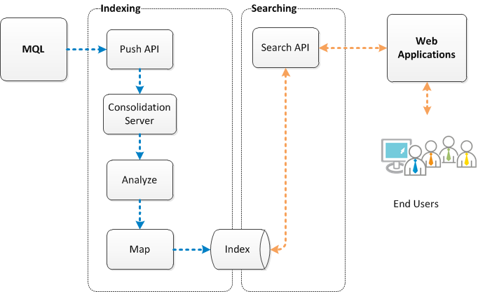

# About the CloudView Server
## CloudView Server Processes and Ports
- CloudView Console : http://<HOSTNAME>:<BASEPORT>+1/admin
- CloudView Console에서는 linux의 ps나 window의 작업관리자에서 보는 것처럼 프로세스들의 목록을 확인할 수 있다.
## CloudView Server Architecture
- indexing되고 검색되는 과정 표현

## CloudView Data Model
- CloudView Admin Console에 접속하여 Index > Data Model에 들어갔을 때 *Set as default class*가 체크가 되어 있는지 확인