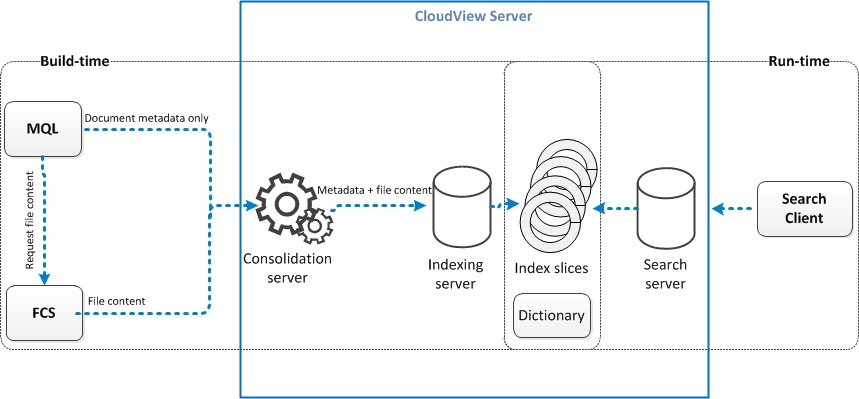

# Focus on CloudView Integration

- build time의 시작은 mql/MCS 부터 시작한다.
- 이미지와 같이 Consolidation Server는 MQL에서 해당 문서의 metadata를 가져오고, FCS를 통해서 file의 content를 가져와서 합병한다.
- build time : Consolidation에서 병합된 metadata와 file content는 indexing server로 전달되어 dictionary 형태로 저장이 된다.
- run time : search client를 통해서 검색 요청된 내용은 search server를 통해 dictionary 형태의 데이터에서 추출하여 반환된다.
