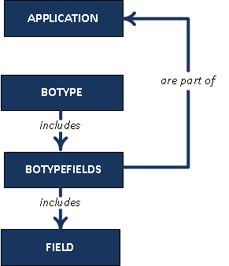

# About the Index Configuration File
> ootb config.xml 파일은 71개의 business object type과 136개의 필드를 가지고 있다.
## Structure

- BOTYPE은 BOTYPEFIELDS를 포함한다.
- BOTYPEFIELDS는 FIELD를 포함한다.
- BOTYPEFIELDS는 APPLICATION의 일부이다.
## Indexing File Names
- 기본적으로 business object에 붙어있는 file들은 자동으로 indexing되지 않는다. 파일의 이름으로 검색하고자 한다면 아래와 같이 작업한다.
```
<FIELD name="FILENAME" select="format.file.name" type="STRING"/>
```
## Wildcard Searches
- wildcard 검색은 Title과 Name 필드에 한해서만 가능하다.
## Recent Content
- 최근 문서 검색 기능에 사용할 vault들을 제한할 수 있다.
```
<RECENTCONTENT includedvaults="eService Production,SIXW,TestVault1"/>
```
- 만일 *RECENTCONTENT includedvaults=""* 이라면 eService Production,SIXW,vplm의 데이터가 기본으로 설정된다. 
## Octree Computation
### Depth
- 3D 요소를 몇개의 노드로 나눌지를 정한다.
- 이 설정에 따라 3D 요소의 렌더링의 정확도가 결정된다
- depth가 작아지면 voxel이 커지고 indexing 성능이 좋아지지만 3D 결과물의 정확도는 떨어진다.
- depth가 커지면 voxel이 작아지고 indexing 성능이 떨어지지만 3D 결과물의 정확도는 올라간다.
### Precision : 정확도
- 절대적 정확도의 제한은 voxel의 생성을 제한하기 위한 보완책이다.
- 만약 설정이 5mm일 경우 voxel의 크기가 5mm로 내려가는 경우 해당 설정은 무시된다.
### Octree 계산을 활성화하려면
- 아래 설정의 <INDEXER> 아래 넣는다.
```
<INDEXER>
 <CHUNK size="10000"/>
  <OCTREE active="true" depth="6" precision="5" />
[…]
```
- active : true(default) / false
- depth : integer greater than 1(depth : 6)
- precision : float greater than 0, mm (default 0)
## Thumbnail Configuration
- 썸네일은 인덱싱 중에 생성된다. 
- 기본적으로 2D와 3D 썸네일은 활성화되어 있지 않다.
- 활성화하려면 명시적으로 선언해야 한다.
- 2D 썸네일
```
<SIMPLIFIEDCGR active="true" />
```
- 3D 썸네일
```
<THUMBNAIL active="true" />
```
## Focus on Type Indexing
- 하위 type은 상위 type의 색인 지정과는 별도로 색인 작성 여부를 자체적으로 정의할 수 있다.
- excludetypes 속성은 폐기되었고 active 속성을 대신 사용한다.(부모의 색인 여부보다 우선한다.)
- type을 indexing하기 위해서 active="true"를 설정한다. indexing에서 제외하기 위해서는 active="false"로 지정한다.
- indexing은 parent나 child에 독립적이다. active 여부는 오로지 자신 type에 대해서만 동작한다.
- subtype에서 부모 type의 검색 field를 상속받고자 하면 inheritfields=ture를 사용한다.
### Inheritance and Indexing
- BOTYPE필드의 inheritfields 속성을 true로 하면 근접한 부모의 indexing 속성을 상속받는다.
- 부모 type의 active가 false더라도 inheritfields가 true면 속성을 상속받는다.
### Replacing Attributes
- 부모에서 excludetypes=child를 지정하고 자식에서 active=true로 줬을 경우 충돌이 발생하기 때문에 excludetypes 속성 폐기
## Override Hard-coded Fields
